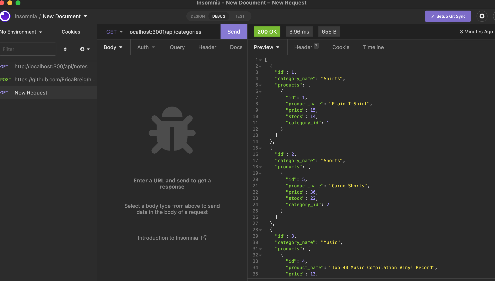

# Homework 13 - Object-Relational Mapping (ORM): E-Commerce Back End

## Table of Contents
1. [Description](#description)
2. [User-Story](#user-story)
3. [Mock-Up](#mock-up)
4. [Credit](#credit)

## Description
In this assignment, we were given an e-commerce database with starter code, and needed to add the necessary functions to complete the API routes, and the models to get the server fully running, so that it can be tested using insomnia.
The following skills were utilized:
- Creating API rotues using Express, sequelize and MySQL2 
- Utilizing PUT, POST, and DELETE in Insomnia

## User-Story

```
AS A manager at an internet retail company
I WANT a back end for my e-commerce website that uses the latest technologies
SO THAT my company can compete with other e-commerce companies

GIVEN a functional Express.js API
WHEN I add my database name, MySQL username, and MySQL password to an environment variable file
THEN I am able to connect to a database using Sequelize
WHEN I enter schema and seed commands
THEN a development database is created and is seeded with test data
WHEN I enter the command to invoke the application
THEN my server is started and the Sequelize models are synced to the MySQL database
WHEN I open API GET routes in Insomnia for categories, products, or tags
THEN the data for each of these routes is displayed in a formatted JSON
WHEN I test API POST, PUT, and DELETE routes in Insomnia
THEN I am able to successfully create, update, and delete data in my database
```

## Mock-Up
The following image shows a preview of the application's functionality.  Click on the image to see a video of the deployed application:
[](https://drive.google.com/drive/folders/1mnNTyYYwlDwvFnLZ0iT6NmRfl54x51_f)
## Credit
Myself, and Trilogy Education Services for the starter code